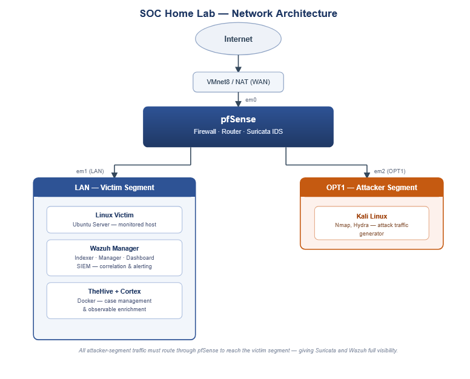
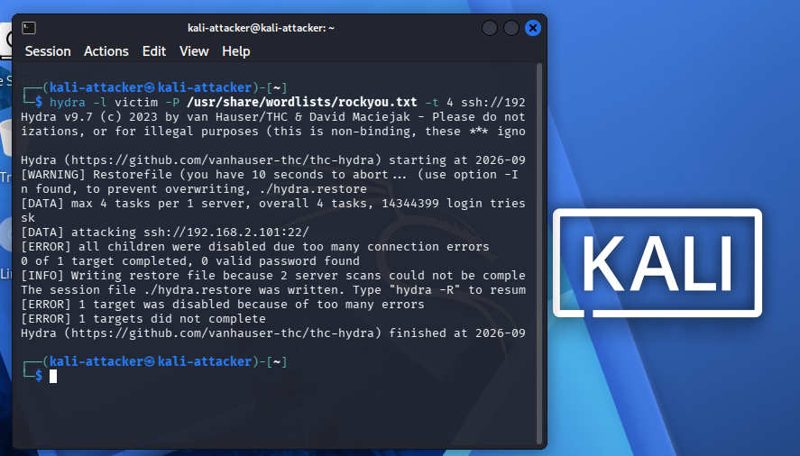
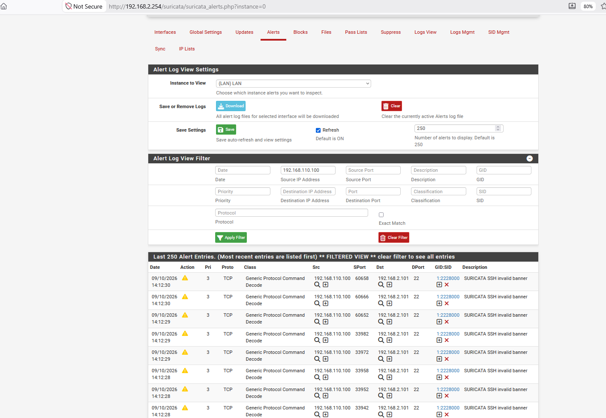
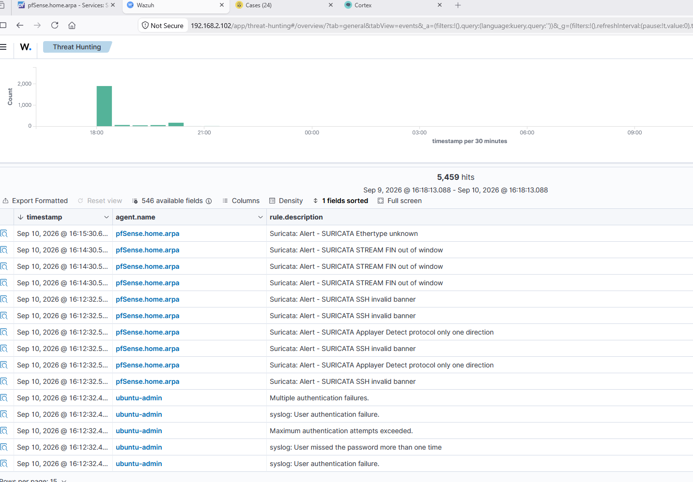
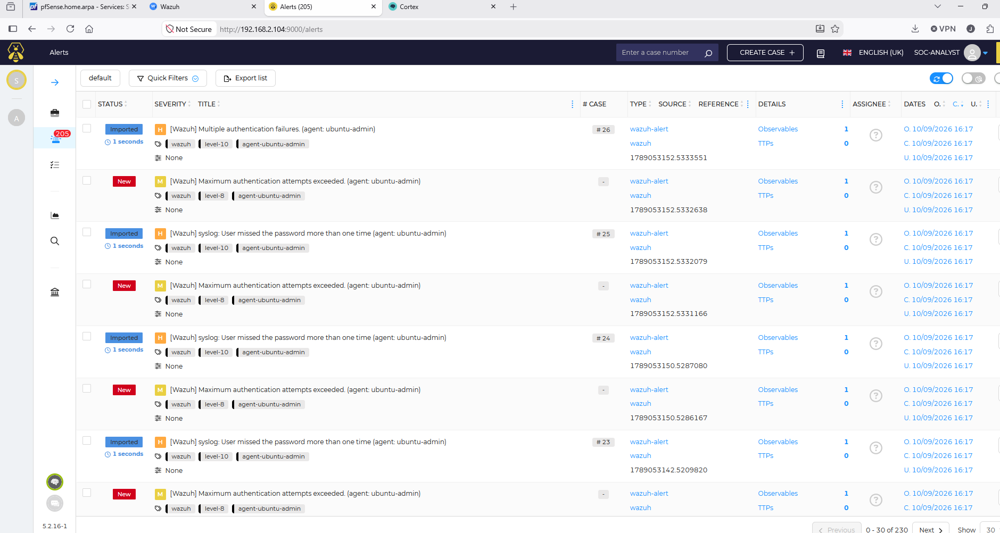
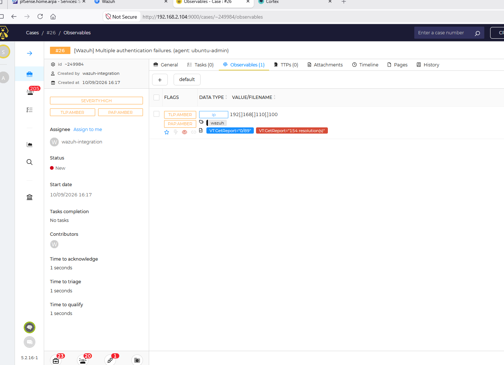
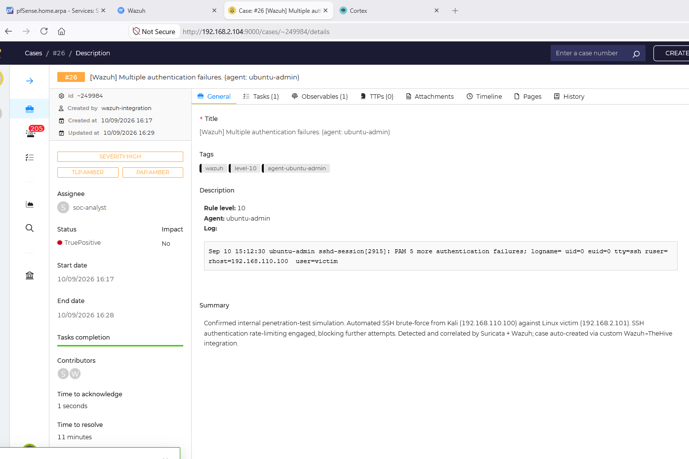

# Open-Source SOC Home Lab

This repository showcases a Security Operations Center (SOC), built from scratch using free and open-source tools, running entirely as virtual machines on a desktop PC.

## Why I built this

To keep it short, I wanted hands-on experience with how detection and response actually work end-to-end — not just knowing what each tool is, but understanding how they deploy, work together, tune, and investigate real attacks from real people. Reading about SOC analyst and tools in textbooks only goes so far; this project was about building the whole stack myself, breaking it, fixing it, and then using it the way an analyst actually would.

Everything in this lab was built and debugged manually — every install issue, every misconfigured firewall rule, and every tuning decision (like realizing a clean Nmap scan doesn't trip a signature-based IDS by default, and writing a custom threshold rule to catch it) is documented as part of the process.

## What this project demonstrates

- Designing and building a segmented virtual network from scratch (attacker segment, victim segment, WAN), with a firewall/router controlling and inspecting traffic between them
- Deploying and tuning a network intrusion detection system (Suricata) — including writing custom threshold-based detection rules to catch attacks that default signatures miss
- Standing up a SIEM (Wazuh) that correlates both network-level and host-level telemetry into a single investigative view
- Generating real attack traffic (port scans, SSH brute-force) from an isolated attacker VM and validating detection end-to-end, not just trusting default configs
- Deploying a case-management and enrichment layer (TheHive + Cortex) and running a full incident lifecycle: detect → investigate → enrich → document → resolve
- Automating the handoff from detection to case management (Wazuh → TheHive), including tuning alert-noise thresholds and auto-escalating high-severity events straight to a case
- Troubleshooting real, undocumented issues along the way — outdated dependency URLs, version-mismatched integration libraries, default-deny firewall behavior, certificate-naming changes between software versions — and fixing them by reading logs and reasoning through the actual cause, not just copy-pasting a fix

## Architecture

All attack traffic from Kali must physically cross through pfSense to reach anything on the victim segment — this is what gives Suricata and Wazuh visibility into it, rather than the two segments talking directly on a flat network.

## How the full pipeline works

1. **Detection (network layer)** — Suricata runs on pfSense, inspecting all traffic crossing between segments. It catches known-bad traffic via the Emerging Threats Open ruleset, protocol anomalies (e.g. a brute-force tool that doesn't speak SSH like a real client), and — via a custom hand-written threshold rule — high-volume reconnaissance like port scans, which default rulesets don't reliably catch out of the box.
2. **Detection (host layer)** — A Wazuh agent on the monitored Linux host watches system and authentication logs directly, catching things Suricata can't see from the network alone (e.g. correlating a spike in failed SSH logins).
3. **Correlation** — A Wazuh agent also runs on pfSense itself, reading Suricata's `eve.json` output and forwarding those network alerts into Wazuh — so network and host telemetry live in one place, one dashboard, one investigation.
4. **Automated handoff** — A custom Python integration (`custom-w2thive.py`) listens for qualifying Wazuh alerts and automatically creates a corresponding Alert in TheHive via its REST API, tagged and pre-populated with relevant observables (e.g. the source IP of an attack). High-severity alerts (Wazuh rule level 10+) are auto-promoted straight to a fully-formed Case, with no analyst action required.
5. **Triage & enrichment** — Lower-severity alerts wait in TheHive's Alerts queue for manual triage. In either case, observables can be enriched on demand through Cortex, which runs analyzers like VirusTotal against IPs, hashes, and domains to pull in external threat intelligence.
6. **Resolution** — Cases are documented with tasks and findings, then closed with a resolution type (e.g. True Positive / No impact) — the same lifecycle a real SOC analyst follows.

## Detection in Action

A real, end-to-end walkthrough: an automated SSH brute-force launched from the isolated Kali attacker VM, caught, correlated, escalated, enriched, and resolved — entirely by the pipeline described above.

**1. The attack** — Hydra running an automated SSH brute-force from Kali against the Linux victim.

**2. Network-layer detection** — Suricata, running on pfSense, flags the malformed SSH handshake pattern as the brute-force tool repeatedly connects.

**3. Correlation in the SIEM** — Wazuh's dashboard shows the network-side detection (`pfSense.home.arpa`) and the host-side detection (`ubuntu-admin`, PAM authentication failures) side by side, in the same timeframe — proving both layers caught the same incident independently.

**4. Automated handoff to TheHive** — The custom Wazuh→TheHive integration script forwards the alert automatically. Because this alert hit Wazuh rule level 10, it was auto-promoted straight into a full case (no analyst click required) — visible here alongside a lower-severity alert (level 8) that correctly stayed in the queue for manual triage instead.

**5. Enrichment via Cortex** — The attacker's IP, already attached as an observable by the automation, enriched on demand with a VirusTotal lookup through Cortex.

**6. Investigation and resolution** — The case fully documented and closed: root cause identified, evidence (the raw PAM log entry) attached, resolved as a confirmed True Positive with no impact. Note `Created by: wazuh-integration` — this entire case was opened automatically, not by a human analyst.

